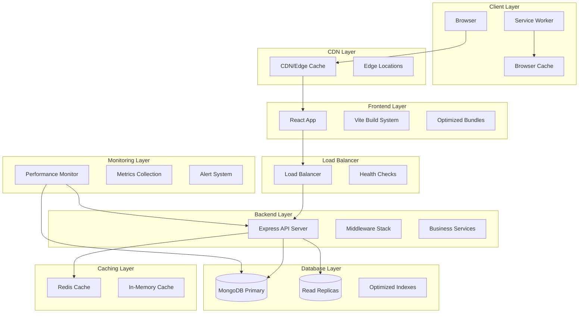

# E-Commerce Performance Optimization Design

## Overview

This document defines the technical design for comprehensive performance optimization of the Nova e-commerce platform. The system currently operates with a React + Vite + TypeScript frontend deployed on Vercel, Node.js + Express + MongoDB backend on Render, and includes product catalog, cart management, order processing, admin panel, authentication, and Stripe payment integration.

The optimization strategy focuses on improving speed, scalability, user experience, and system resilience across all layers while maintaining existing functionality. The approach targets measurable performance improvements: sub-2-second page loads, sub-200ms API responses for cached data, sub-500ms for non-cached data, and support for 100+ concurrent requests.

**Current Architecture:**
- **Frontend**: React 19 + Vite 6 + TypeScript + Tailwind CSS + Zustand + React Query
- **Backend**: Node.js + Express + MongoDB + Mongoose + JWT + Stripe
- **Deployment**: Vercel (frontend) + Render (backend) + MongoDB Atlas
- **Key Features**: Product catalog, shopping cart, order management, user authentication, admin panel, payment processing

---

## Architecture

### High-Level Architecture



### Performance Optimization Layers

1. **Frontend Optimization Layer**
   - Code splitting and lazy loading
   - Bundle optimization and tree shaking
   - Image optimization and lazy loading
   - Service worker caching
   - React performance optimizations

2. **API Performance Layer**
   - Response compression
   - Request/response caching
   - Connection pooling
   - Pagination and query optimization
   - Concurrent request handling

3. **Database Performance Layer**
   - Index optimization
   - Query optimization
   - Connection pooling
   - Read replica scaling
   - Aggregation pipeline optimization

4. **Caching Strategy Layer**
   - Multi-level caching (browser, CDN, Redis, in-memory)
   - Cache invalidation strategies
   - Cache warming and preloading
   - Edge caching for static assets

5. **Infrastructure Layer**
   - Load balancing and horizontal scaling
   - Health checks and circuit breakers
   - Resource monitoring and auto-scaling
   - Zero-downtime deployments

---

## Components and Interfaces

### Frontend Performance Components

#### Bundle Analyzer Integration
```typescript
interface BundleAnalyzer {
  analyzeBundle(): BundleReport;
  identifyLargeChunks(threshold: number): ChunkInfo[];
  generateSizeReport(): SizeReport;
  trackBundleSize(): void;
}

interface BundleReport {
  totalSize: number;
  chunks: ChunkInfo[];
  dependencies: DependencyInfo[];
  recommendations: OptimizationRecommendation[];
}
```

#### Code Splitting Manager
```typescript
interface CodeSplittingManager {
  splitByRoute(): RouteChunk[];
  splitByFeature(): FeatureChunk[];
  implementLazyLoading(): LazyComponent[];
  optimizeChunkLoading(): ChunkLoadingStrategy;
}

interface LazyComponent {
  componentName: string;
  loadingStrategy: 'eager' | 'lazy' | 'preload';
  fallbackComponent: React.ComponentType;
}
```

#### Image Optimization Service
```typescript
interface ImageOptimizationService {
  implementLazyLoading(): LazyImageConfig;
  optimizeImageFormats(): ImageFormatConfig;
  generateResponsiveImages(): ResponsiveImageSet;
  preloadCriticalImages(): PreloadConfig;
}

interface LazyImageConfig {
  threshold: string; // Intersection observer threshold
  rootMargin: string;
  placeholder: 'blur' | 'skeleton' | 'none';
}
```

#### Service Worker Manager
```typescript
interface ServiceWorkerManager {
  cacheStaticAssets(): CacheStrategy;
  implementOfflineSupport(): OfflineStrategy;
  handleCacheInvalidation(): InvalidationStrategy;
  preloadCriticalResources(): PreloadStrategy;
}

interface CacheStrategy {
  staticAssets: CacheConfig;
  apiResponses: CacheConfig;
  images: CacheConfig;
}
```

### Backend Performance Components

#### Response Compression Service
```typescript
interface CompressionService {
  compressResponse(data: any, format: 'gzip' | 'brotli'): Buffer;
  shouldCompress(request: Request): boolean;
  getOptimalCompression(contentType: string): CompressionConfig;
}

interface CompressionConfig {
  algorithm: 'gzip' | 'brotli';
  level: number;
  threshold: number;
  mimeTypes: string[];
}
```

#### API Cache Manager
```typescript
interface APICacheManager {
  cacheResponse(key: string, data: any, ttl: number): Promise<void>;
  getCachedResponse(key: string): Promise<any | null>;
  invalidateCache(pattern: string): Promise<void>;
  setCacheHeaders(response: Response, ttl: number): void;
}

interface CacheConfig {
  defaultTTL: number;
  maxSize: number;
  keyGenerator: (request: Request) => string;
  invalidationRules: InvalidationRule[];
}
```

#### Connection Pool Manager
```typescript
interface ConnectionPoolManager {
  createPool(config: PoolConfig): ConnectionPool;
  monitorPoolHealth(): PoolMetrics;
  adjustPoolSize(metrics: PoolMetrics): void;
  handleConnectionFailure(): void;
}

interface PoolConfig {
  minConnections: number;
  maxConnections: number;
  acquireTimeoutMillis: number;
  idleTimeoutMillis: number;
}
```

#### Pagination Service
```typescript
interface PaginationService {
  paginateQuery<T>(
    query: Query<T>,
    page: number,
    limit: number
  ): Promise<PaginatedResult<T>>;
  
  generatePaginationMeta(
    total: number,
    page: number,
    limit: number
  ): PaginationMeta;
}

interface PaginatedResult<T> {
  data: T[];
  pagination: PaginationMeta;
}

interface PaginationMeta {
  currentPage: number;
  totalPages: number;
  totalItems: number;
  hasNext: boolean;
  hasPrev: boolean;
}
```

### Database Performance Components

#### Index Optimization Manager
```typescript
interface IndexOptimizationManager {
  analyzeQueryPatterns(): QueryPattern[];
  recommendIndexes(): IndexRecommendation[];
  createOptimalIndexes(): Promise<void>;
  monitorIndexUsage(): IndexUsageStats;
}

interface IndexRecommendation {
  collection: string;
  fields: IndexField[];
  type: 'single' | 'compound' | 'text' | 'geospatial';
  priority: 'high' | 'medium' | 'low';
}
```

#### Query Optimization Service
```typescript
interface QueryOptimizationService {
  optimizeAggregationPipeline(pipeline: any[]): any[];
  addQueryHints(query: any): any;
  batchQueries(queries: Query[]): Promise<any[]>;
  logSlowQueries(threshold: number): void;
}

interface QueryPerformanceMetrics {
  executionTime: number;
  documentsExamined: number;
  documentsReturned: number;
  indexUsed: boolean;
}
```

### Caching Layer Components

#### Redis Cache Service
```typescript
interface RedisCacheService {
  set(key: string, value: any, ttl?: number): Promise<void>;
  get(key: string): Promise<any | null>;
  del(key: string): Promise<void>;
  invalidatePattern(pattern: string): Promise<void>;
  setupClustering(): Promise<void>;
}

interface CacheInvalidationService {
  invalidateOnUpdate(entity: string, id: string): Promise<void>;
  invalidateOnCreate(entity: string): Promise<void>;
  invalidateOnDelete(entity: string, id: string): Promise<void>;
  scheduleInvalidation(key: string, delay: number): Promise<void>;
}
```

#### CDN Integration Service
```typescript
interface CDNService {
  uploadStaticAssets(assets: Asset[]): Promise<void>;
  setEdgeCaching(config: EdgeCacheConfig): Promise<void>;
  purgeCache(paths: string[]): Promise<void>;
  optimizeAssetDelivery(): Promise<void>;
}

interface EdgeCacheConfig {
  staticAssets: CacheDuration;
  apiResponses: CacheDuration;
  images: CacheDuration;
}
```

### Monitoring and Performance Components

#### Performance Monitor
```typescript
interface PerformanceMonitor {
  trackAPIResponseTime(endpoint: string, duration: number): void;
  trackDatabaseQueryTime(query: string, duration: number): void;
  trackFrontendMetrics(metrics: WebVitals): void;
  generatePerformanceReport(): PerformanceReport;
  sendAlert(alert: PerformanceAlert): void;
}

interface WebVitals {
  LCP: number; // Largest Contentful Paint
  FID: number; // First Input Delay
  CLS: number; // Cumulative Layout Shift
  TTFB: number; // Time to First Byte
}

interface PerformanceAlert {
  type: 'response_time' | 'error_rate' | 'resource_usage';
  severity: 'low' | 'medium' | 'high' | 'critical';
  message: string;
  metrics: any;
  timestamp: Date;
}
```

#### Resource Monitor
```typescript
interface ResourceMonitor {
  trackCPUUsage(): number;
  trackMemoryUsage(): MemoryMetrics;
  trackDatabaseConnections(): ConnectionMetrics;
  trackCacheHitRate(): CacheMetrics;
  triggerScalingAlert(threshold: number): void;
}

interface MemoryMetrics {
  used: number;
  total: number;
  percentage: number;
  heapUsed: number;
  heapTotal: number;
}
```

---

## Data Models

### Performance Metrics Schema
```typescript
interface PerformanceMetrics {
  id: string;
  timestamp: Date;
  endpoint: string;
  responseTime: number;
  statusCode: number;
  userAgent: string;
  ipAddress: string;
  cacheHit: boolean;
  databaseQueryTime?: number;
  memoryUsage?: number;
  cpuUsage?: number;
}
```

### Cache Entry Schema
```typescript
interface CacheEntry {
  key: string;
  value: any;
  ttl: number;
  createdAt: Date;
  lastAccessed: Date;
  hitCount: number;
  tags: string[];
}
```

### Bundle Analysis Schema
```typescript
interface BundleAnalysis {
  id: string;
  buildId: string;
  timestamp: Date;
  totalSize: number;
  gzippedSize: number;
  chunks: ChunkAnalysis[];
  dependencies: DependencyAnalysis[];
  recommendations: string[];
}

interface ChunkAnalysis {
  name: string;
  size: number;
  gzippedSize: number;
  modules: string[];
  isAsync: boolean;
}
```

### Performance Threshold Configuration
```typescript
interface PerformanceThresholds {
  pageLoadTime: number; // 2000ms
  apiResponseTime: {
    cached: number; // 200ms
    uncached: number; // 500ms
  };
  databaseQueryTime: {
    simple: number; // 100ms
    aggregation: number; // 300ms
    slow: number; // 200ms (for logging)
  };
  concurrentRequests: number; // 100
  errorRate: number; // 1%
  resourceUsage: {
    cpu: number; // 80%
    memory: number; // 80%
  };
}
```

---

## Error Handling

### Error Boundary Implementation
```typescript
interface ErrorBoundaryConfig {
  fallbackComponent: React.ComponentType<ErrorFallbackProps>;
  onError: (error: Error, errorInfo: ErrorInfo) => void;
  enableRetry: boolean;
  maxRetries: number;
}

interface ErrorFallbackProps {
  error: Error;
  resetError: () => void;
  retry: () => void;
}
```

### API Error Handling with Retry Logic
```typescript
interface RetryConfig {
  maxRetries: number;
  baseDelay: number;
  maxDelay: number;
  backoffMultiplier: number;
  retryableStatusCodes: number[];
}

interface CircuitBreakerConfig {
  failureThreshold: number;
  resetTimeout: number;
  monitoringPeriod: number;
}
```

### Graceful Degradation Strategy
```typescript
interface GracefulDegradationConfig {
  criticalFeatures: string[];
  nonCriticalFeatures: string[];
  fallbackBehaviors: Map<string, FallbackBehavior>;
  resourceThresholds: ResourceThresholds;
}

interface FallbackBehavior {
  disableFeature: boolean;
  showFallbackUI: boolean;
  cacheLastKnownGood: boolean;
  notifyUser: boolean;
}
```

### Offline Support Strategy
```typescript
interface OfflineStrategy {
  criticalPages: string[];
  cacheStrategy: 'cache-first' | 'network-first' | 'stale-while-revalidate';
  offlineIndicator: boolean;
  queueFailedRequests: boolean;
  syncOnReconnect: boolean;
}
```

---

## Correctness Properties

*A property is a characteristic or behavior that should hold true across all valid executions of a system-essentially, a formal statement about what the system should do. Properties serve as the bridge between human-readable specifications and machine-verifiable correctness guarantees.*

After analyzing the acceptance criteria, the following properties are suitable for property-based testing as they represent universal behaviors that should hold across varying inputs:

### Property 1: Bundle Analysis Accuracy

*For any* bundle configuration with chunks of varying sizes, the Bundle Analyzer SHALL correctly identify and report all chunks exceeding the 500KB threshold, with no false positives or false negatives.

**Validates: Requirements 1.3**

### Property 2: Complete Chunk Reporting

*For any* production build containing N chunks, the Bundle Analyzer SHALL generate a size report that includes exactly N chunks with accurate size information for each.

**Validates: Requirements 1.4**

### Property 3: Image Lazy Loading Based on Viewport

*For any* page layout with images at different viewport positions, the Frontend System SHALL apply lazy loading to images below the fold while immediately loading images above the fold.

**Validates: Requirements 1.6**

### Property 4: Response Compression by Size and Type

*For any* API response above the compression threshold, the Backend System SHALL apply gzip or brotli compression based on the content type and client capabilities.

**Validates: Requirements 2.3**

### Property 5: Performance Metrics Logging Completeness

*For any* API request processed by the system, the Backend System SHALL log performance metrics including response time, status code, and cache hit status.

**Validates: Requirements 2.5**

### Property 6: Cache Header Consistency

*For any* API endpoint with defined caching behavior, the Backend System SHALL return appropriate HTTP cache-control headers consistent with the endpoint's caching strategy.

**Validates: Requirements 2.6**

### Property 7: Pagination Metadata Accuracy

*For any* dataset requiring pagination, the Backend System SHALL return paginated results with accurate metadata including current page, total pages, total items, and navigation flags.

**Validates: Requirements 2.7**

### Property 8: Structured Error Response Timing

*For any* error condition in API processing, the Backend System SHALL return a structured error response within the specified time limit while maintaining consistent error format.

**Validates: Requirements 2.8**

### Property 9: Connection Pool Load Adaptation

*For any* system load level, the Connection Pool SHALL maintain an appropriate number of active connections between the minimum and maximum bounds based on current demand.

**Validates: Requirements 3.5**

### Property 10: Query Result Caching Behavior

*For any* frequently accessed query, the Backend System SHALL cache the result and serve subsequent identical queries from cache until expiration.

**Validates: Requirements 3.6**

### Property 11: Slow Query Logging Threshold

*For any* database query execution, the Backend System SHALL log queries that exceed the 200-millisecond threshold while not logging faster queries.

**Validates: Requirements 3.7**

### Property 12: Cache TTL Enforcement

*For any* cached data with specified expiration time, the Cache System SHALL serve the data from cache before expiration and fetch fresh data after expiration.

**Validates: Requirements 4.1**

### Property 13: Cache Invalidation on Data Updates

*For any* product data update operation, the Cache System SHALL invalidate all related cache entries to ensure data consistency.

**Validates: Requirements 4.3**

### Property 14: Cached Response Header Inclusion

*For any* API response that is cached, the Backend System SHALL include appropriate cache-control headers indicating the caching status and expiration.

**Validates: Requirements 4.4**

### Property 15: Asynchronous Cache Population

*For any* cache miss scenario, the Backend System SHALL populate the cache asynchronously without blocking the response to the client.

**Validates: Requirements 4.7**

### Property 16: Error Boundary Exception Handling

*For any* JavaScript error occurring within wrapped components, the Error Boundary SHALL catch the error and display the configured fallback UI.

**Validates: Requirements 5.1**

### Property 17: API Retry Logic with Exponential Backoff

*For any* failed API request, the Frontend System SHALL retry up to 3 times using exponential backoff timing between attempts.

**Validates: Requirements 5.2**

### Property 18: Circuit Breaker State Management

*For any* pattern of external service failures exceeding the threshold, the Circuit Breaker SHALL open to prevent further calls and close after the reset timeout.

**Validates: Requirements 5.3**

### Property 19: Database Reconnection with Backoff

*For any* database connection failure, the Backend System SHALL attempt reconnection using exponential backoff timing until successful or maximum attempts reached.

**Validates: Requirements 5.4**

### Property 20: Payment Error Logging and User Messages

*For any* payment processing failure, the Backend System SHALL log the detailed error information and return a user-friendly error message to the client.

**Validates: Requirements 5.6**

### Property 21: Error Rate Alert Triggering

*For any* time period where error rates exceed 1% of total requests, the Performance Monitor SHALL trigger alerts to administrators.

**Validates: Requirements 5.7**

### Property 22: Graceful Degradation Resource Thresholds

*For any* system state where resources exceed critical thresholds, the Backend System SHALL disable non-critical features while maintaining core functionality.

**Validates: Requirements 5.8**

### Property 23: File Upload Streaming by Size

*For any* file upload operation, the Backend System SHALL stream files above the size threshold to prevent memory exhaustion while handling smaller files normally.

**Validates: Requirements 6.5**

### Property 24: Rate Limiting Per User Enforcement

*For any* user making requests, the Backend System SHALL enforce rate limits per user, blocking requests that exceed the configured rate while allowing requests within limits.

**Validates: Requirements 6.6**

### Property 25: Resource Usage Alert Triggering

*For any* system resource (CPU, memory, connections) reaching 80% capacity, the Performance Monitor SHALL trigger scaling alerts.

**Validates: Requirements 6.7**

### Property 26: API Response Time Tracking Completeness

*For any* API endpoint receiving requests, the Performance Monitor SHALL track and record response times for all requests to that endpoint.

**Validates: Requirements 7.1**

### Property 27: Performance Alert Timing

*For any* performance metric exceeding configured thresholds, the Performance Monitor SHALL send alerts within 1 minute of threshold breach.

**Validates: Requirements 7.2**

### Property 28: Database Performance Metrics Collection

*For any* database operation (query, connection pool usage), the Performance Monitor SHALL collect and track performance metrics.

**Validates: Requirements 7.4**

### Property 29: Error Rate Spike Immediate Notification

*For any* sudden increase in error rates, the Performance Monitor SHALL trigger immediate notifications without delay.

**Validates: Requirements 7.5**

### Property 30: User Experience Metrics Tracking

*For any* user interaction (page load, UI interaction), the Performance Monitor SHALL track and record user experience metrics.

**Validates: Requirements 7.7**

### Property 31: Critical Resource Alert Escalation

*For any* system resource reaching critical levels, the Performance Monitor SHALL escalate alerts to on-call personnel according to escalation procedures.

**Validates: Requirements 7.8**

### Property 32: Image Optimization by Device

*For any* image request from a client device, the CDN System SHALL optimize image format and size based on the requesting device's capabilities.

**Validates: Requirements 8.2**

### Property 33: Static Asset Compression and Minification

*For any* static asset served through the CDN, the system SHALL apply appropriate compression and minification based on asset type.

**Validates: Requirements 8.5**

### Property 34: Virtual Scrolling for Large Lists

*For any* list exceeding the configured size threshold, the Frontend System SHALL implement virtual scrolling to limit DOM nodes.

**Validates: Requirements 8.7**

### Property 35: Background Task Job Queue Usage

*For any* background task execution, the Backend System SHALL use job queues to prevent blocking the main thread.

**Validates: Requirements 8.8**

### Property 36: Deployment Performance Impact Tracking

*For any* deployment operation, the Performance Monitor SHALL track and measure the impact on performance metrics before, during, and after deployment.

**Validates: Requirements 10.5**

---

## Testing Strategy

## Testing Strategy

### Dual Testing Approach

The testing strategy employs both unit tests and property-based tests to ensure comprehensive coverage:

**Unit Tests**: Focus on specific examples, edge cases, error conditions, and integration points between components. These tests validate concrete scenarios and ensure individual components work correctly.

**Property-Based Tests**: Validate universal properties across all inputs using randomized test data. Each property test runs a minimum of 100 iterations to thoroughly explore the input space and catch edge cases that might be missed by example-based tests.

### Property-Based Testing Configuration

**Testing Library**: Fast-check for JavaScript/TypeScript property-based testing
- Minimum 100 iterations per property test
- Custom generators for domain-specific data (products, users, orders, etc.)
- Shrinking capability to find minimal failing examples

**Property Test Implementation**:
Each correctness property will be implemented as a property-based test with the following tag format:
```javascript
// Feature: ecommerce-optimization, Property 1: Bundle Analysis Accuracy
```

**Test Categories by Property**:

1. **Bundle and Build Properties (1-4)**
   - Generate varying bundle configurations
   - Test chunk analysis and reporting accuracy
   - Validate build optimization behaviors

2. **API Performance Properties (5-8)**
   - Generate requests with varying sizes and types
   - Test compression, caching, and pagination behaviors
   - Validate error response consistency

3. **Database and Caching Properties (9-15)**
   - Generate varying query patterns and data sets
   - Test connection pooling and cache behaviors
   - Validate cache invalidation and TTL enforcement

4. **Error Handling and Resilience Properties (16-22)**
   - Generate various error conditions and failure scenarios
   - Test retry logic, circuit breakers, and graceful degradation
   - Validate error logging and user message consistency

5. **Scalability and Resource Properties (23-28)**
   - Generate varying load patterns and resource usage
   - Test rate limiting, file streaming, and monitoring
   - Validate alert triggering and resource management

6. **Optimization and Performance Properties (29-36)**
   - Generate varying content types and device configurations
   - Test image optimization, asset compression, and virtual scrolling
   - Validate deployment impact tracking and background task handling

### Integration and Performance Testing

**Load Testing Scenarios**:
- 100+ concurrent users for API endpoints
- Database query performance under varying loads
- Cache performance with high hit rates
- Memory usage under sustained load

**Performance Regression Testing**:
- Bundle size monitoring with automated alerts
- API response time benchmarks
- Database query performance baselines
- Core Web Vitals tracking

**End-to-End Performance Validation**:
- Complete user journey timing (browse → add to cart → checkout)
- Cross-browser performance testing
- Mobile device performance validation
- Network throttling scenarios

### Monitoring Integration in Tests

**Development Environment Testing**:
- Real-time performance feedback during development
- Bundle size warnings in CI/CD pipeline
- Query performance alerts in development
- Memory leak detection in test runs

**Production-Like Testing**:
- Staging environment performance validation
- Load testing with production-like data volumes
- Cache behavior validation under realistic conditions
- Error handling validation with production error patterns

### Test Data Generation Strategy

**Property Test Generators**:
```javascript
// Example generators for property-based tests
const productGenerator = fc.record({
  name: fc.string({ minLength: 1, maxLength: 100 }),
  price: fc.float({ min: 0.01, max: 10000 }),
  stock: fc.integer({ min: 0, max: 1000 }),
  images: fc.array(fc.webUrl(), { minLength: 1, maxLength: 10 })
});

const bundleConfigGenerator = fc.record({
  chunks: fc.array(fc.record({
    name: fc.string(),
    size: fc.integer({ min: 1000, max: 2000000 }), // 1KB to 2MB
    isAsync: fc.boolean()
  }), { minLength: 1, maxLength: 50 })
});

const apiRequestGenerator = fc.record({
  endpoint: fc.constantFrom('/products', '/orders', '/users', '/cart'),
  method: fc.constantFrom('GET', 'POST', 'PUT', 'DELETE'),
  payload: fc.option(fc.object()),
  headers: fc.dictionary(fc.string(), fc.string())
});
```

### Performance Baseline Establishment

**Baseline Metrics**:
- Current page load times: 4-6 seconds → Target: < 2 seconds
- Current API response times: 800ms-2s → Target: < 200ms cached, < 500ms uncached
- Current bundle sizes: ~2MB → Target: < 500KB initial bundle
- Current database query times: 200ms-1s → Target: < 100ms simple, < 300ms aggregation

**Regression Detection**:
- Automated performance regression detection in CI/CD
- Alert thresholds: 20% degradation triggers investigation
- Performance budgets enforced at build time
- Continuous monitoring of Core Web Vitals in production

### Test Environment Configuration

**Local Development**:
- Hot module replacement for instant feedback
- Performance profiling tools integrated
- Bundle analyzer running on every build
- Memory usage monitoring during development

**CI/CD Pipeline**:
- Performance regression tests on every PR
- Bundle size analysis and reporting
- Load testing on staging environment
- Performance budget enforcement

**Production Monitoring**:
- Real user monitoring (RUM) for actual performance data
- Synthetic monitoring for consistent baseline measurements
- Error tracking with performance correlation
- Resource usage monitoring with auto-scaling triggers

---

## Implementation Phases

### Phase 1: Frontend Performance Foundation (Week 1-2)
1. **Bundle Optimization**
   - Implement webpack-bundle-analyzer
   - Configure code splitting for routes
   - Set up tree shaking optimization
   - Add bundle size monitoring

2. **Image and Asset Optimization**
   - Implement lazy loading for images
   - Set up responsive image generation
   - Configure CDN integration
   - Add image format optimization

3. **React Performance Optimizations**
   - Add React.memo to expensive components
   - Implement useMemo for heavy computations
   - Optimize re-render patterns
   - Add performance profiling

### Phase 2: Backend API Performance (Week 2-3)
1. **Response Optimization**
   - Implement gzip/brotli compression
   - Add response caching headers
   - Set up API response caching
   - Configure request logging with metrics

2. **Database Query Optimization**
   - Analyze and optimize existing queries
   - Add missing indexes
   - Implement query result caching
   - Set up slow query logging

3. **Connection and Concurrency**
   - Configure connection pooling
   - Implement concurrent request handling
   - Add request queuing for high load
   - Set up health check endpoints

### Phase 3: Caching Strategy Implementation (Week 3-4)
1. **Multi-Level Caching**
   - Set up Redis cache service
   - Implement browser caching strategy
   - Configure CDN edge caching
   - Add cache invalidation logic

2. **Cache Warming and Preloading**
   - Implement cache warming for critical data
   - Add preloading for frequently accessed content
   - Set up cache clustering for high availability
   - Configure cache monitoring

### Phase 4: Monitoring and Resilience (Week 4-5)
1. **Performance Monitoring**
   - Implement Core Web Vitals tracking
   - Set up API performance monitoring
   - Add database performance tracking
   - Configure alerting system

2. **Error Handling and Resilience**
   - Implement error boundaries
   - Add retry logic with exponential backoff
   - Set up circuit breaker pattern
   - Configure graceful degradation

3. **Scalability Preparation**
   - Implement stateless backend design
   - Set up load balancer configuration
   - Add auto-scaling triggers
   - Configure zero-downtime deployments

### Phase 5: Security Performance Integration (Week 5-6)
1. **Efficient Security Measures**
   - Optimize authentication token validation
   - Implement efficient rate limiting
   - Add security headers without performance impact
   - Optimize input validation

2. **Development and Deployment Optimization**
   - Set up hot module replacement
   - Add development performance profiling
   - Implement build-time optimizations
   - Configure performance regression testing

---

## Deployment Strategy

### Zero-Downtime Deployment Process
1. **Blue-Green Deployment**
   - Maintain two identical production environments
   - Deploy to inactive environment first
   - Switch traffic after health checks pass
   - Keep previous version for quick rollback

2. **Database Migration Strategy**
   - Backward-compatible schema changes
   - Gradual data migration for large changes
   - Index creation during low-traffic periods
   - Connection pool management during migrations

3. **CDN and Cache Management**
   - Coordinate cache invalidation with deployments
   - Preload critical assets to CDN
   - Gradual cache warming after deployment
   - Monitor cache hit rates post-deployment

### Performance Validation Pipeline
1. **Pre-Deployment Testing**
   - Run performance regression tests
   - Validate bundle size thresholds
   - Check API response time benchmarks
   - Verify database query performance

2. **Post-Deployment Monitoring**
   - Track deployment impact on performance metrics
   - Monitor error rates and response times
   - Validate cache performance
   - Check resource usage patterns

3. **Rollback Criteria**
   - Response time degradation > 20%
   - Error rate increase > 2%
   - Resource usage spike > 90%
   - Core Web Vitals regression

---

## Success Metrics

### Performance Targets
- **Page Load Time**: < 2 seconds (currently ~4-6 seconds)
- **API Response Time**: < 200ms cached, < 500ms uncached
- **Database Query Time**: < 100ms simple queries, < 300ms aggregations
- **Concurrent Request Handling**: 100+ simultaneous requests
- **Bundle Size Reduction**: 30-50% smaller initial bundles
- **Cache Hit Rate**: > 80% for frequently accessed data

### User Experience Metrics
- **Core Web Vitals**:
  - LCP (Largest Contentful Paint): < 2.5s
  - FID (First Input Delay): < 100ms
  - CLS (Cumulative Layout Shift): < 0.1

### System Performance Metrics
- **Error Rate**: < 1% of total requests
- **Uptime**: > 99.9%
- **Resource Usage**: < 80% CPU and memory under normal load
- **Cache Performance**: < 10ms cache response time

### Business Impact Metrics
- **Conversion Rate**: Expected 15-25% improvement
- **Bounce Rate**: Expected 20-30% reduction
- **User Engagement**: Expected 10-20% increase in session duration
- **Operational Costs**: Optimized resource usage reducing infrastructure costs
