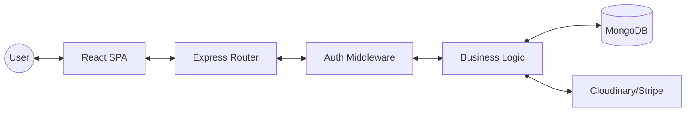

<div align="center">
  # 🌌 NOVA | Premium MERN E-Commerce Platform
  
  **Sophisticated. Secure. Scalable.**

  [](https://mongodb.com)
  [](https://tailwindcss.com)
  [](https://owasp.org)

</div>

---

## 📖 Introduction

**NOVA** is a production-grade, high-end e-commerce platform built with the MERN stack. Designed for luxury lifestyle brands, it balances minimalist aesthetics with heavy-duty engineering—featuring robust secondary-auth security, a modular SaaS architecture, and a site-wide responsive design system.

---

## 🛠️ Tech Stack

### Frontend
- **React 18** + **Vite** (Ultra-fast HMR)
- **Tailwind CSS** (Premium utility-first styling)
- **Zustand** (Atomic state management with persistence)
- **Lucide React** (Sleek, minimalist iconography)
- **Axios** (Hardened API communication with auto-refresh tokens)

### Backend
- **Node.js** & **Express**
- **MongoDB** & **Mongoose** (Stateless modeling)
- **JWT + Refresh Token** (Dual-layer authentication)
- **CSRF Protection** (Double-submit cookie pattern)
- **Stripe** (Secure payment processing)
- **Cloudinary** (Dynamic asset management)
- **EmailJS** (Branded customer notifications)

---

## ✨ Primary Features

| Feature | Description |
| :--- | :--- |
| **Luxury UI** | Premium minimalist design with full-screen overlays and fluid animations. |
| **Responsive 2.0** | Mobile-first architecture with hamburger menus, accordions, and touch sliders. |
| **Secure Auth** | Stateless JWT system with automatic token refresh and secure OTP workflows. |
| **Advanced Shop** | Real-time filtering, recursive search, and category-based navigation. |
| **Admin Power** | Comprehensive dashboard for product management, image uploads, and order fulfillment. |

---

## 🏗️ System Architecture



---

## 🚀 Getting Started

### 1. Prerequisites
- **Node.js** (v18+)
- **MongoDB Atlas** account
- **Cloudinary** & **Stripe** API Keys

### 2. Installation
```bash
# Clone the repository
git clone https://github.com/Qaziaaaa/ecommerce-system.git

# Setup Backend
cd backend
npm install
cp .env.example .env

# Setup Frontend
cd ../frontend
npm install
cp .env.example .env
```

### 3. Running Locally
```bash
# Start Backend (Term 1)
cd backend
npm run dev

# Start Frontend (Term 2)
cd frontend
npm run dev
```

---

## 🛡️ Security Implementation
- **CSRF**: Double-submit cookie hardening on all state-changing requests.
- **JWT**: HttpOnly cookies for session storage to prevent XSS.
- **Rate Limiting**: Applied to Auth and OTP routes to prevent brute-force attacks.
- **Validation**: Strict Zod schema enforcement on both client and server layers.

---

## 🤝 Contributing
Contributions are welcome. Please open an issue or submit a PR for major architectural changes.

---

<div align="center">
  <sub>Built with ❤️ by the NOVA Engineering Team</sub>
</div>
